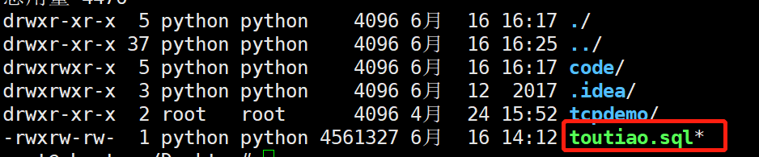
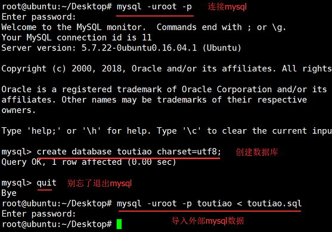
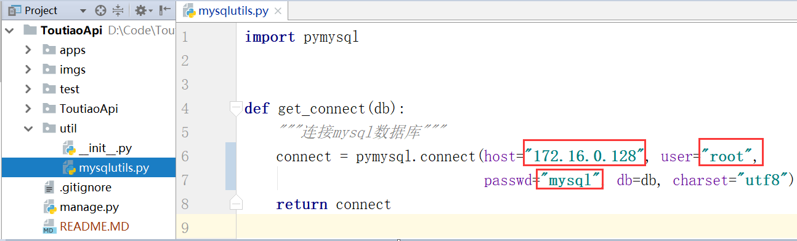
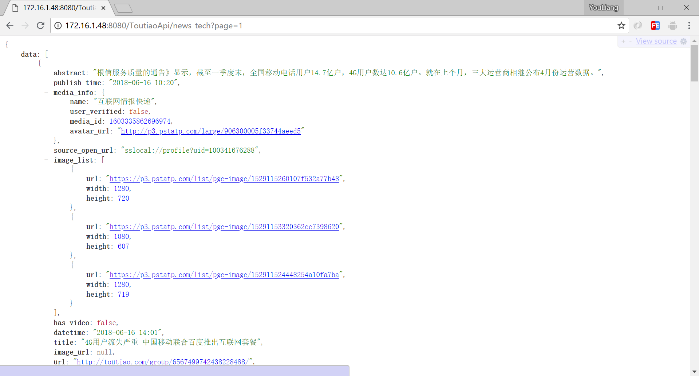
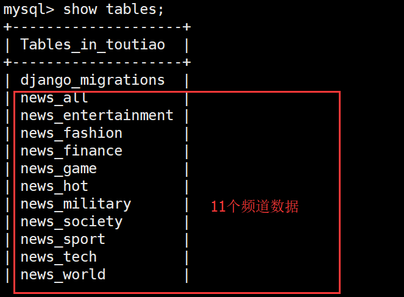

## Django web 接口开发-提供5000条新闻数据

### 1.导入mysql数据

将当前项目toutiao.sql文件，拷贝到服务器。

在toutiao.sql同一个目录下，将sql文件导入数据库中，详细执行命令请参考下面截图。该过程根据提示输入mysql密码：

	$ mysql -uroot -p toutiao < toutiao.sql

### 2.修改web项目mysql配置

修改/util/mysqlutils.py模块中mysql配置，改成自己的配置：

### 3.运行服务器

在ToutiaoApi项目根目录下运行django：

	python manage.py runserver 0.0.0.0:8080

### 4.访问视图

下图对应视图函数：/apps/news/views.py模块中的news_tech()函数

	http://ip:端口/ToutiaoApi/news?tag=news_tech&page=1

### 5.各个频道url地址说明

	示例url：http://ip:端口/ToutiaoApi/news?tag=news_tech&page=1
	tag：频道名称
	page：页码

		
11个频道说明：

	news_tech               科技新闻
	news_all                推荐新闻
	news_host               热点新闻
	news_entertainment      娱乐新闻
	news_sport              体育新闻
	news_fashion            时尚新闻
	news_finance            金融新闻
	news_military           军事新闻
	news_society            社会新闻
	news_world              世界新闻
	news_game               游戏新闻

